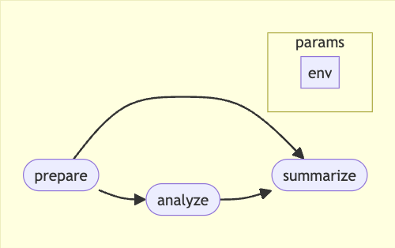

# A Nextflow pipeline to webscrape Pubmed results by genes

This repo can be used as a template Nextflow pipeline that parallelise processes by gene IDs.

## Pipeline

The pipeline consists of three steps:

1. `prepare`: Download gene list from Ensembl Biomart.

2. `analyze`: Webscrape Pubmed for publications related to each gene. This step is parallelised by gene names/ids.

3. `summarize`: Aggregate and format the results.

### maxForks in `analyze` process

The allowed request rate to the NCBI Entrez programming utilities (E-utilities), which PubMed uses, is 3 requests per second without an API key. With an API key, the default rate is 10 requests per second, and higher rates are available by request according to the National Institutes of Health (NIH).

To avoid hitting the rate limit, the `analyze` process in this pipeline is configured with a reduced `maxForks` value of 5. This means that at most 5 requests will be made concurrently, which should help to stay within the allowed request rate.